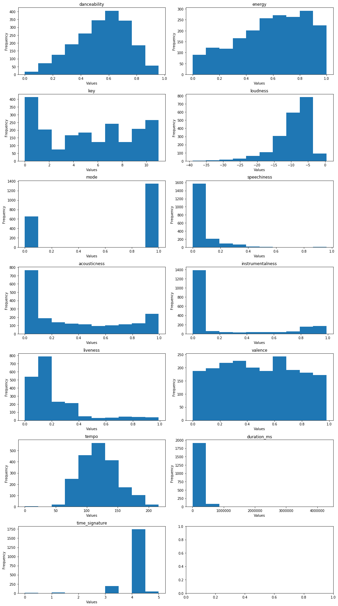

# SQLite database for data hosting
***
In this project, we used the Million Playlists Dataset from Spotify website. They were stored in a bundle of json files of Python dictionaries which had information about individual playlists and all tracks that each playlists contained. To organize the data in a form that was easy to work with, we built a SQLite database and registered information about playlists and tracks into tables.
***
## Load libraries


```python
import sys, os
import sqlite3
import pandas as pd
import json
import numpy as np
import matplotlib
import matplotlib.pyplot as plt
import seaborn as sns
%matplotlib inline
```


## Create the database and tables
***
We built the database ***spotifyDB.db*** and created two tables for hosting tracks and playlists.


```python
# create a new database by connecting to it
conn = sqlite3.connect("spotifyDB.db")
cur = conn.cursor()
```


```python
# create the tracks table
cur.execute('''CREATE TABLE IF NOT EXISTS tracks (track text PRIMARY KEY,
         track_name text, album text, album_name text, artist text, artist_name text,
         duration_ms integer, playlist_member text, num_member integer
         );''')

conn.commit()
```


```python
# create playlists table
cur.execute('''CREATE TABLE IF NOT EXISTS playlists (playlist_id INTEGER PRIMARY KEY AUTOINCREMENT,
         playlist_name TEXT, collaborative TEXT, modified_at INTEGER, num_tracks INTEGER, num_albums INTEGER,
         num_artists INTEGER, num_followers INTEGER, num_edits INTEGER, playlist_duration_ms INTEGER,
         tracks TEXT);''')

conn.commit()
```


## Register playlist-track information into tables
***
### Function definitions
First we defined several functions to process and prepare data for insertion.

- ***process_playlist*** extracts playlists information from Python dictionaries.

- ***clean_uri*** removes extra information and returns cleaned Spotify uri.

- ***process_tracks_into_df*** processes track information in DataFrames.

- ***prepare_tracks_update*** prepares track dataFrame for batch insertion and update.


```python
def process_playlist(playlist_dict):
    columns = ['playlist_name','collaborative','modified_at','num_tracks','num_albums',
               'num_artists','num_followers','num_edits','duration_ms']

    playlist = {}

    for col in columns:
        if col in playlist_dict.keys():
            playlist[col] = playlist_dict[col]
        else:
            playlist[col] = None

    if 'name' in playlist_dict.keys() and playlist['playlist_name'] == None:
        playlist['playlist_name'] =playlist_dict['name']

    all_track_uri = [tr['track_uri'].split(':')[-1] for tr in playlist_dict['tracks']]
    all_track_uri = ','.join(set(all_track_uri)) # take unique tracks
    playlist['tracks'] = all_track_uri
    playlist['playlist_duration_ms'] = playlist.pop('duration_ms')

    playlist_df = pd.DataFrame(playlist, index=[0])
    playlist_df = playlist_df.set_index('playlist_name')

    return playlist_df
```


```python
def clean_uri(track,uri):
    if type(track[uri])!=type(None):
        cleaned_uri = track[uri].split(':')[-1]
    elif type(track[uri])==type(None):
        cleaned_uri = ''
    return cleaned_uri
```


```python
def process_tracks_into_df(tracks, playlist_id):
    # convert tracks into dataframe
    tracks_df = pd.DataFrame.from_dict(tracks)
    # remove duplicates of tracks
    tracks_df = tracks_df.drop_duplicates('track_uri')
    # clean up uri
    tracks_df['track'] = tracks_df.apply(lambda x: clean_uri(x,'track_uri'), axis=1)
    tracks_df['album'] = tracks_df.apply(lambda x: clean_uri(x,'album_uri'), axis=1)
    tracks_df['artist'] = tracks_df.apply(lambda x: clean_uri(x,'artist_uri'), axis=1)
    # drop unnecessary columns
    tracks_df = tracks_df.drop(['pos','track_uri','album_uri','artist_uri'], axis = 1)
    # set index to track
    tracks_df = tracks_df.set_index('track')
    # add playlist membership
    tracks_df['playlist_member'] = str(playlist_id)
    # add number of membership
    tracks_df['num_member'] = 1

    return tracks_df
```


```python
def prepare_tracks_update(tracks_df, playlist_id, conn, cur):
    # make keys of all tracks
    tracks_in_playlist = list(tracks_df.index)
    keys = tracks_in_playlist
    keys = '\',\''.join(keys)
    keys = "('"+keys+"')"

    # fetch existing keys
    query = 'SELECT * FROM tracks WHERE track IN {};'.format(keys)
    existing_tuples = pd.read_sql_query(query, conn)

    # if none of the track exists, return whole tracks_df
    if len(existing_tuples) == 0:
        tracks_df_new = tracks_df.copy()

    # if there are pre-existing tracks
    elif len(existing_tuples) > 0:
        # expand playlist membership
        existing_tuples['playlist_member'] = existing_tuples.apply(
            lambda x: x.playlist_member + ',' + str(playlist_id), axis=1)
        existing_tuples['num_member'] = existing_tuples.apply(
            lambda x: x.num_member + 1, axis=1)
        existing_tuples= existing_tuples.set_index('track')

        # delete existing keys
        query = 'DELETE FROM tracks WHERE track IN {};'.format(keys)
        cur.execute(query)
        conn.commit()

        # extract non-existing tracks
        existing_mask = tracks_df.index.isin(existing_tuples.index)
        tracks_df_new = tracks_df.iloc[~existing_mask].copy()

        # combine non-exisitng tracks with updated exisiting tracks
        tracks_df_new = tracks_df_new.append(existing_tuples)

    return tracks_df_new
```


## Data registration
***
We subselected 50% of the files and register them into tables.


```python
# prepare paths to the files
mpd_path ='PATH TO DATA FOLDER'
playlist_path = []

for path, subdirs, files in os.walk(mpd_path):
    for name in files:
        if name.endswith('.json'):
            playlist_path.append(os.path.join(path, name))

# subselect half of the files
playlist_path_sub = playlist_path[:-1:2].copy()

len(playlist_path_sub)
```


```python
#### Main scripts for data registration ####

# prelocate list to host processed and unprocessed files
processed_files = []
unprocessed_files = playlist_path.copy()

# loop over file subsets
for file_ind, filepath in enumerate(playlist_path_sub):
    # keep track of files that have been processed
    print('File number = ', file_ind)
    unprocessed_files.remove(filepath)
    processed_files.append(filepath)

    # load the file
    with open(filepath, "r") as fd:
        data = json.load(fd)

    # find number of playlists
    num_playlist = len(data['playlists'])

    # loop over all playlists
    for playlist_dict in data['playlists']:
        # process playlist
        this_playlist = process_playlist(playlist_dict)

        # insert playlist into playlists table
        this_playlist.to_sql('playlists', conn, if_exists='append')

        # get playlist_id (the most recent inserted (max playlist_id))
        query_max_id = 'SELECT MAX(playlist_id) FROM playlists;'
        playlist_id = cur.execute(query_max_id).fetchall()[0][0]

        # get list of all tracks and process into dataframe
        these_tracks = playlist_dict['tracks']
        tracks_df = process_tracks_into_df(these_tracks, playlist_id)

        # get tracks dataframe for insertion
        tracks_df_to_insert = prepare_tracks_update(tracks_df, playlist_id, conn, cur)

        # insert tracks dataframe into tracks table
        tracks_df_to_insert.to_sql('tracks', conn, if_exists='append')
```


# Visualization of tables and EDA
***
After registering the data, we can take a look at the tables and simple statistics of them.

## Tracks table
***
Here is how the tracks table look like:


```python
display(pd.read_sql_query("SELECT * FROM tracks WHERE num_member > 2 LIMIT 10;", conn))
```


<div>
<style scoped>
    .dataframe tbody tr th:only-of-type {
        vertical-align: middle;
    }

    .dataframe tbody tr th {
        vertical-align: top;
    }

    .dataframe thead th {
        text-align: right;
    }
</style>
<table border="1" class="dataframe">
  <thead>
    <tr style="text-align: right;">
      <th></th>
      <th>track</th>
      <th>track_name</th>
      <th>album</th>
      <th>album_name</th>
      <th>artist</th>
      <th>artist_name</th>
      <th>duration_ms</th>
      <th>playlist_member</th>
      <th>num_member</th>
    </tr>
  </thead>
  <tbody>
    <tr>
      <th>0</th>
      <td>4orbjP0tCRTyz1mzaBBNfe</td>
      <td>Tiny Prayers</td>
      <td>5SThok56qPZWKBkCgo1jvX</td>
      <td>LP3</td>
      <td>7emzuJJA7yCSe3lFP0geRX</td>
      <td>Restorations</td>
      <td>270813</td>
      <td>31,2007,2104</td>
      <td>3</td>
    </tr>
    <tr>
      <th>1</th>
      <td>3ef2Xwb3miZB3uQrwk02CY</td>
      <td>Lose My Number</td>
      <td>2fHfgG1QPIUgkh9aGrLj2i</td>
      <td>Lose My Number</td>
      <td>2NDqx1z4TTkFr0QOnk8nX3</td>
      <td>Haley Mae Campbell</td>
      <td>218526</td>
      <td>4596,10318,11660</td>
      <td>3</td>
    </tr>
    <tr>
      <th>2</th>
      <td>4gNtnaq83U4wxI4ZA0wJpY</td>
      <td>Supne</td>
      <td>4Ynd6YaRlyUU9J8Ew6DXpv</td>
      <td>Supne</td>
      <td>6zZrFenNe3YPttxZsnQQs1</td>
      <td>Akhil</td>
      <td>229537</td>
      <td>4800,10539,13872</td>
      <td>3</td>
    </tr>
    <tr>
      <th>3</th>
      <td>5NIN7nEnHkvDjttYPiAv0l</td>
      <td>Oye Como Va</td>
      <td>1de9ZEWcUihEjpfseRslwm</td>
      <td>Greatest Hits</td>
      <td>57EAEbnYbr1PFzadw9Zvgi</td>
      <td>Fattburger</td>
      <td>244120</td>
      <td>2916,13633,17009</td>
      <td>3</td>
    </tr>
    <tr>
      <th>4</th>
      <td>1PtXb911Zu4ZEtS0Ury1Yy</td>
      <td>Fallen Angel</td>
      <td>2UzKuFTNWbXd5xyicK2h3K</td>
      <td>Cast Of Thousands</td>
      <td>0TJB3EE2efClsYIDQ8V2Jk</td>
      <td>Elbow</td>
      <td>247933</td>
      <td>3480,11029,17192</td>
      <td>3</td>
    </tr>
    <tr>
      <th>5</th>
      <td>1NChReYoZE87Tm4lSWbIsy</td>
      <td>Don't Stop</td>
      <td>6uL7RW7IgFL9naC4Z4MNqm</td>
      <td>Don't Stop</td>
      <td>62eXubdnqpsK7IFweKENa6</td>
      <td>London Future</td>
      <td>215586</td>
      <td>7985,11363,13502,17860</td>
      <td>4</td>
    </tr>
    <tr>
      <th>6</th>
      <td>3XuLKKhDXHO2z5iAj8jTn8</td>
      <td>The Broken Promise/O'Mahoney's/Murphy's Reel</td>
      <td>7nivc3NHA0HbmVF1KKajmD</td>
      <td>Herding Cats</td>
      <td>5dlzTgw97q5k5ws89Ww1UK</td>
      <td>Gaelic Storm</td>
      <td>275133</td>
      <td>4207,10906,13305,18293</td>
      <td>4</td>
    </tr>
    <tr>
      <th>7</th>
      <td>1WgYHGlEsnPf1fYRvBBvoK</td>
      <td>Fix You</td>
      <td>63lHCog4E73RzcCGEpbrj7</td>
      <td>Masters of Chant: Chapter VI</td>
      <td>5QO1NNCLglKxgogzx6XLJn</td>
      <td>Gregorian</td>
      <td>303840</td>
      <td>1043,15903,16372,20553</td>
      <td>4</td>
    </tr>
    <tr>
      <th>8</th>
      <td>6QAu3FW5u1kpzagMkM4a4T</td>
      <td>Great Is the Lord</td>
      <td>6REyEw2vFqrh6YA7cYF8uD</td>
      <td>God With Us</td>
      <td>3YCKuqpv9nCsIhJ2v8SMix</td>
      <td>Elevation Worship</td>
      <td>243666</td>
      <td>8193,10145,20676</td>
      <td>3</td>
    </tr>
    <tr>
      <th>9</th>
      <td>0L9CaGzVcW61cJFOS7uaFC</td>
      <td>Pure</td>
      <td>0bRZr4eXClow3U7OGB4iyh</td>
      <td>Souvenir</td>
      <td>2eTosKYENiHrq3S8d1S0it</td>
      <td>David Keller</td>
      <td>480000</td>
      <td>4318,9224,20886</td>
      <td>3</td>
    </tr>
  </tbody>
</table>
</div>


The playlist IDs that each track was a member of were stored in the table, which can be used to link to the playlists table.

### Number of playlist membership
***
We can look at the statisitcs of number of playlist membership of tracks. Here we are showing only tracks that belonged to a least 2 playlists, which consist of 2.4% of all the tracks (799,008 over 32,705,544 tracks). As we can see, among those tracks, the mean was ~40, and the distribution was really right skewed.


```python
sns.set()

n_tr = pd.read_sql_query("select num_member FROM tracks WHERE num_member > 1;", conn)
display(n_tr.describe())

mem = pd.read_sql_query("select num_member FROM tracks WHERE num_member > 1;", conn)
mem.describe()
plt.hist(np.log(np.array(mem)),bins = 15)
plt.xlabel('Log(number of playlist membership)', fontsize = 15)
plt.ylabel('Count', fontsize = 15)
plt.title('Distribution of number of playlist membership of tracks', fontsize = 15);
```


<div>
<style scoped>
    .dataframe tbody tr th:only-of-type {
        vertical-align: middle;
    }

    .dataframe tbody tr th {
        vertical-align: top;
    }

    .dataframe thead th {
        text-align: right;
    }
</style>
<table border="1" class="dataframe">
  <thead>
    <tr style="text-align: right;">
      <th></th>
      <th>num_member</th>
    </tr>
  </thead>
  <tbody>
    <tr>
      <th>count</th>
      <td>799008.000000</td>
    </tr>
    <tr>
      <th>mean</th>
      <td>39.928869</td>
    </tr>
    <tr>
      <th>std</th>
      <td>296.983336</td>
    </tr>
    <tr>
      <th>min</th>
      <td>2.000000</td>
    </tr>
    <tr>
      <th>25%</th>
      <td>2.000000</td>
    </tr>
    <tr>
      <th>50%</th>
      <td>4.000000</td>
    </tr>
    <tr>
      <th>75%</th>
      <td>12.000000</td>
    </tr>
    <tr>
      <th>max</th>
      <td>22839.000000</td>
    </tr>
  </tbody>
</table>
</div>


## Playlists table
***
This is our playlists table. The Spotify uri's for all tracks that each playlist contained were stored in the table.


```python
display(pd.read_sql_query("SELECT * FROM playlists WHERE num_followers > 10 LIMIT 5;", conn))
```


<div>
<style scoped>
    .dataframe tbody tr th:only-of-type {
        vertical-align: middle;
    }

    .dataframe tbody tr th {
        vertical-align: top;
    }

    .dataframe thead th {
        text-align: right;
    }
</style>
<table border="1" class="dataframe">
  <thead>
    <tr style="text-align: right;">
      <th></th>
      <th>playlist_id</th>
      <th>playlist_name</th>
      <th>collaborative</th>
      <th>modified_at</th>
      <th>num_tracks</th>
      <th>num_albums</th>
      <th>num_artists</th>
      <th>num_followers</th>
      <th>num_edits</th>
      <th>playlist_duration_ms</th>
      <th>tracks</th>
    </tr>
  </thead>
  <tbody>
    <tr>
      <th>0</th>
      <td>242</td>
      <td>Tegan and Sara</td>
      <td>false</td>
      <td>1464998400</td>
      <td>151</td>
      <td>25</td>
      <td>7</td>
      <td>18</td>
      <td>17</td>
      <td>29003627</td>
      <td>3P4skIO0EF1c3C93GNwQpa,5QJ0W0dYxu3PuaO4Fo84sp,...</td>
    </tr>
    <tr>
      <th>1</th>
      <td>256</td>
      <td>Christmas Mix</td>
      <td>false</td>
      <td>1387152000</td>
      <td>32</td>
      <td>28</td>
      <td>25</td>
      <td>22</td>
      <td>3</td>
      <td>6772221</td>
      <td>5QunGzRKeXjEHPfaG6BScP,5EDUhfn84BfHrS26RZ5vef,...</td>
    </tr>
    <tr>
      <th>2</th>
      <td>297</td>
      <td>Worship</td>
      <td>false</td>
      <td>1508198400</td>
      <td>35</td>
      <td>31</td>
      <td>26</td>
      <td>11</td>
      <td>19</td>
      <td>8320641</td>
      <td>1pnrwYOFzmP7f1P77QsspG,67JFpAWQvohcwoYYsDqP5l,...</td>
    </tr>
    <tr>
      <th>3</th>
      <td>366</td>
      <td>Chill Rock</td>
      <td>false</td>
      <td>1460332800</td>
      <td>128</td>
      <td>114</td>
      <td>90</td>
      <td>15</td>
      <td>18</td>
      <td>29409896</td>
      <td>0sgpDWD8lFKaJNSFuhULyq,46GGxd8TVRt6FjUBfCavVT,...</td>
    </tr>
    <tr>
      <th>4</th>
      <td>517</td>
      <td>smooth jams</td>
      <td>false</td>
      <td>1509062400</td>
      <td>188</td>
      <td>171</td>
      <td>140</td>
      <td>13</td>
      <td>41</td>
      <td>48588746</td>
      <td>1z35crfs2inLHpArGKuHFd,68ZD7M5tOBBM0N5XWRECoD,...</td>
    </tr>
  </tbody>
</table>
</div>


### Number of tracks in playlists
***
We can look at the number of tracks contained in each playlists. On average, each playlist had 66 tracks, and again it was a right skewed distribution.


```python
n_pl = pd.read_sql_query("SELECT num_tracks FROM playlists;", conn)
display(n_pl.describe())

plt.hist(np.array(n_pl),bins = 15)
plt.xlabel('Number of tracks in playlists', fontsize = 15)
plt.ylabel('Count', fontsize = 15)
plt.title('Distribution of number of tracks in playlists', fontsize = 15);
```


<div>
<style scoped>
    .dataframe tbody tr th:only-of-type {
        vertical-align: middle;
    }

    .dataframe tbody tr th {
        vertical-align: top;
    }

    .dataframe thead th {
        text-align: right;
    }
</style>
<table border="1" class="dataframe">
  <thead>
    <tr style="text-align: right;">
      <th></th>
      <th>num_tracks</th>
    </tr>
  </thead>
  <tbody>
    <tr>
      <th>count</th>
      <td>500000.000000</td>
    </tr>
    <tr>
      <th>mean</th>
      <td>66.296618</td>
    </tr>
    <tr>
      <th>std</th>
      <td>53.685938</td>
    </tr>
    <tr>
      <th>min</th>
      <td>5.000000</td>
    </tr>
    <tr>
      <th>25%</th>
      <td>26.000000</td>
    </tr>
    <tr>
      <th>50%</th>
      <td>49.000000</td>
    </tr>
    <tr>
      <th>75%</th>
      <td>91.000000</td>
    </tr>
    <tr>
      <th>max</th>
      <td>376.000000</td>
    </tr>
  </tbody>
</table>
</div>


We can kind of get a sense here that this dataset is very sparse. We had a huge number of playlists and tracks, but the chance that one playlist contained one particular track was pretty low.

## Closing cursor and disconnecting database


```python
# close cursor and connection
cur.close()
conn.close()
```


```python
import sys, os
import sqlite3
import pandas as pd
import json
import numpy as np
import matplotlib
import matplotlib.pyplot as plt
import seaborn as sns
%matplotlib inline

```


## Exploration of the Spotify API data - audio features

In order to understand the audio features, we can look at the distribution of the data provided by the Spotify API.

```python
# Access spotify
import spotipy as sp
import spotipy.oauth2 as oauth2
import sqlite3
import pandas as pd

# set up authorization token
credentials = oauth2.SpotifyClientCredentials(
        client_id='CLIENT_ID',
        client_secret='CLIENT_SECRET')

token = credentials.get_access_token()
spotify = sp.Spotify(auth=token)
```


```python
# Explore 500 tracks

N = 2000

audio_feat_tracks = pd.read_sql_query("SELECT * from tracks ORDER BY RANDOM() LIMIT {};".format(N), conn)

```


```python
# Take track IDs in order to access the API

ids = audio_feat_tracks['track'].values.tolist()

# All audio features -- for EDA

danceability = []
energy = []
key = []
loudness = []
mode = []
speechiness = []
acousticness = []
instrumentalness = []
liveness = []
valence = []
tempo = []
duration_ms = []
time_signature = []

features = [danceability, energy, key, loudness, mode, speechiness, acousticness,\
           instrumentalness, liveness, valence, tempo, duration_ms, time_signature]

feature_names = ['danceability', 'energy', 'key', 'loudness', 'mode', 'speechiness',\
                 'acousticness', 'instrumentalness', 'liveness', 'valence', 'tempo', \
                 'duration_ms', 'time_signature']

# Collect into lists:

for track_id in ids:
    results = spotify.audio_features(tracks=track_id)

    # Add into lists
    danceability.append(results[0]['danceability'])
    energy.append(results[0]['energy'])
    key.append(results[0]['key'])
    loudness.append(results[0]['loudness'])
    mode.append(results[0]['mode'])
    speechiness.append(results[0]['speechiness'])
    acousticness.append(results[0]['acousticness'])
    instrumentalness.append(results[0]['instrumentalness'])
    liveness.append(results[0]['liveness'])
    valence.append(results[0]['valence'])
    tempo.append(results[0]['tempo'])
    duration_ms.append(results[0]['duration_ms'])
    time_signature.append(results[0]['time_signature'])


```


    retrying ...1secs
    retrying ...1secs
    retrying ...1secs
    retrying ...1secs
    retrying ...1secs
    retrying ...1secs
    retrying ...1secs
    retrying ...1secs
    retrying ...1secs
    retrying ...1secs
    retrying ...1secs
    retrying ...1secs
    retrying ...1secs


```python
# Plot distributions

N_features = len(feature_names)

fig, ax = plt.subplots(ncols = 2, nrows = N_features//2+1, figsize = (14,25))
for i in range(N_features):
    ax[i//2, i%2].hist(features[i]);
    ax[i//2, i%2].set_title(feature_names[i])
    ax[i//2, i%2].set_ylabel('Frequency')
    ax[i//2, i%2].set_xlabel('Values')

plt.tight_layout()

```





We notice that the distributions for danceability and tempo are somewhat normal, whereas the valence distribution is almost uniform. For the other variables, some of which are categorical, and others are continuous with varying distributions. This information will be useful to keep in mind when building our models.


---- ----- ----- -----
