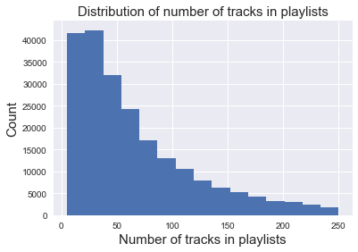

CS109a Final Project Milestone 3

Group 32

Members: Andra Fehmiu, Shih-Yi Tseng, Liam Corrigan, Alkmini Chalofti

Project: Spotify project

Import libraries


```python
import sys, os
import sqlite3
import pandas as pd
import json
import numpy as np
import matplotlib
import matplotlib.pyplot as plt
import seaborn as sns
%matplotlib inline
sns.set()
```


Create/connect to database


```python
# create a new database by connecting to it
conn = sqlite3.connect("spotifyDB.db")
cur = conn.cursor()
```


Create tables for playlists and tracks


```python
# create the tracks table

cur.execute('''CREATE TABLE IF NOT EXISTS tracks (track text PRIMARY KEY,
         track_name text, album text, album_name text, artist text, artist_name text,
         duration_ms integer, playlist_member text, num_member integer
         );''')

conn.commit()
```


```python
# create playlists table

cur.execute('''CREATE TABLE IF NOT EXISTS playlists (playlist_id INTEGER PRIMARY KEY AUTOINCREMENT,
         playlist_name TEXT, collaborative TEXT, modified_at INTEGER, num_tracks INTEGER, num_albums INTEGER,
         num_artists INTEGER, num_followers INTEGER, num_edits INTEGER, playlist_duration_ms INTEGER,
         tracks TEXT);''')

conn.commit()
```


Collect paths to Million Playlist Files


```python
mpd_path ='C:\\Users\\Shih-Yi\\Documents\\mpd.v1\\mpd\\data'
playlist_path = []

for path, subdirs, files in os.walk(mpd_path):
    for name in files:
        if name.endswith('.json'):
            playlist_path.append(os.path.join(path, name))
```


Define functions for processing playlists data


```python
def process_playlist(playlist_dict):
    columns = ['playlist_name','collaborative','modified_at','num_tracks','num_albums',
               'num_artists','num_followers','num_edits','duration_ms']

    playlist = {}

    for col in columns:
        if col in playlist_dict.keys():
            playlist[col] = playlist_dict[col]
        else:
            playlist[col] = None

    if 'name' in playlist_dict.keys() and playlist['playlist_name'] == None:
        playlist['playlist_name'] =playlist_dict['name']

    all_track_uri = [tr['track_uri'].split(':')[-1] for tr in playlist_dict['tracks']]
    all_track_uri = ','.join(set(all_track_uri)) # take unique tracks
    playlist['tracks'] = all_track_uri
    playlist['playlist_duration_ms'] = playlist.pop('duration_ms')

    playlist_df = pd.DataFrame(playlist, index=[0])
    playlist_df = playlist_df.set_index('playlist_name')

    return playlist_df

def clean_uri(track,uri):
    if type(track[uri])!=type(None):
        cleaned_uri = track[uri].split(':')[-1]
    elif type(track[uri])==type(None):
        cleaned_uri = ''
    return cleaned_uri

def process_tracks_into_df(tracks, playlist_id):
    # convert tracks into dataframe
    tracks_df = pd.DataFrame.from_dict(tracks)
    # remove duplicates of tracks
    tracks_df = tracks_df.drop_duplicates('track_uri')
    # clean up uri
    tracks_df['track'] = tracks_df.apply(lambda x: clean_uri(x,'track_uri'), axis=1)
    tracks_df['album'] = tracks_df.apply(lambda x: clean_uri(x,'album_uri'), axis=1)
    tracks_df['artist'] = tracks_df.apply(lambda x: clean_uri(x,'artist_uri'), axis=1)
    # drop unnecessary columns
    tracks_df = tracks_df.drop(['pos','track_uri','album_uri','artist_uri'], axis = 1)
    # set index to track
    tracks_df = tracks_df.set_index('track')
    # add playlist membership
    tracks_df['playlist_member'] = str(playlist_id)
    # add number of membership
    tracks_df['num_member'] = 1

    return tracks_df

def prepare_tracks_update(tracks_df, playlist_id, conn, cur):
    # make keys of all tracks
    tracks_in_playlist = list(tracks_df.index)
    keys = tracks_in_playlist
    keys = '\',\''.join(keys)
    keys = "('"+keys+"')"

    # fetch existing keys
    query = 'SELECT * FROM tracks WHERE track IN {};'.format(keys)
    existing_tuples = pd.read_sql_query(query, conn)

    # if none of the track exists, return whole tracks_df
    if len(existing_tuples) == 0:
        tracks_df_new = tracks_df.copy()

    # if there are pre-existing tracks
    elif len(existing_tuples) > 0:
        # expand playlist membership
        existing_tuples['playlist_member'] = existing_tuples.apply(lambda x: x.playlist_member + ',' + str(playlist_id), axis=1)
        existing_tuples['num_member'] = existing_tuples.apply(lambda x: x.num_member + 1, axis=1)
        existing_tuples= existing_tuples.set_index('track')

        # delete existing keys
        query = 'DELETE FROM tracks WHERE track IN {};'.format(keys)
        cur.execute(query)
        conn.commit()

        # extract non-existing tracks
        existing_mask = tracks_df.index.isin(existing_tuples.index)
        tracks_df_new = tracks_df.iloc[~existing_mask].copy()

        # combine non-exisitng tracks with updated exisiting tracks
        tracks_df_new = tracks_df_new.append(existing_tuples)

    return tracks_df_new

```


Main scripts for registering data into playlists and tracks tables


```python
#### Main scripts

# subselect half of the files
playlist_path_sub = playlist_path[:-1:2].copy()

len(playlist_path_sub)

# prelocate list to host processed and unprocessed files
processed_files = []
unprocessed_files = playlist_path.copy()

# loop over file subsets
for file_ind, filepath in enumerate(playlist_path_sub):
    # keep track of files that have been processed
    print('File number = ', file_ind)
    unprocessed_files.remove(filepath)
    processed_files.append(filepath)

    # load the file
    with open(filepath, "r") as fd:
        data = json.load(fd)

    # find number of playlists
    num_playlist = len(data['playlists'])

    # loop over all playlists
    for playlist_dict in data['playlists']:
        # process playlist
        this_playlist = process_playlist(playlist_dict)

        # insert playlist into playlists table
        this_playlist.to_sql('playlists', conn, if_exists='append')

        # get playlist_id (the most recent inserted (max playlist_id))
        query_max_id = 'SELECT MAX(playlist_id) FROM playlists;'
        playlist_id = cur.execute(query_max_id).fetchall()[0][0]

        # get list of all tracks and process into dataframe
        these_tracks = playlist_dict['tracks']
        tracks_df = process_tracks_into_df(these_tracks, playlist_id)

        # get tracks dataframe for insertion
        tracks_df_to_insert = prepare_tracks_update(tracks_df, playlist_id, conn, cur)

        # insert tracks dataframe into tracks table
        tracks_df_to_insert.to_sql('tracks', conn, if_exists='append')

```


```python
# check tables
display(pd.read_sql_query("select * from playlists LIMIT 5;", conn))
display(pd.read_sql_query("select * from tracks LIMIT 5;", conn))
```


<div>
<style>
    .dataframe thead tr:only-child th {
        text-align: right;
    }

    .dataframe thead th {
        text-align: left;
    }

    .dataframe tbody tr th {
        vertical-align: top;
    }
</style>
<table border="1" class="dataframe">
  <thead>
    <tr style="text-align: right;">
      <th></th>
      <th>playlist_id</th>
      <th>playlist_name</th>
      <th>collaborative</th>
      <th>modified_at</th>
      <th>num_tracks</th>
      <th>num_albums</th>
      <th>num_artists</th>
      <th>num_followers</th>
      <th>num_edits</th>
      <th>playlist_duration_ms</th>
      <th>tracks</th>
    </tr>
  </thead>
  <tbody>
    <tr>
      <th>0</th>
      <td>1</td>
      <td>Throwbacks</td>
      <td>false</td>
      <td>1493424000</td>
      <td>52</td>
      <td>47</td>
      <td>37</td>
      <td>1</td>
      <td>6</td>
      <td>11532414</td>
      <td>3BxWKCI06eQ5Od8TY2JBeA,215JYyyUnrJ98NK3KEwu6d,...</td>
    </tr>
    <tr>
      <th>1</th>
      <td>2</td>
      <td>Awesome Playlist</td>
      <td>false</td>
      <td>1506556800</td>
      <td>39</td>
      <td>23</td>
      <td>21</td>
      <td>1</td>
      <td>5</td>
      <td>11656470</td>
      <td>6Vz7vzOpCwKeSQlfViibuY,1HZ3cUZUw5htSFmah1V8Ko,...</td>
    </tr>
    <tr>
      <th>2</th>
      <td>3</td>
      <td>korean</td>
      <td>false</td>
      <td>1505692800</td>
      <td>64</td>
      <td>51</td>
      <td>31</td>
      <td>1</td>
      <td>18</td>
      <td>14039958</td>
      <td>36FPRDpKyP8hJxPhJs4G17,3VC1IEz9M1txlMSx3h3tPM,...</td>
    </tr>
    <tr>
      <th>3</th>
      <td>4</td>
      <td>mat</td>
      <td>false</td>
      <td>1501027200</td>
      <td>126</td>
      <td>107</td>
      <td>86</td>
      <td>1</td>
      <td>4</td>
      <td>28926058</td>
      <td>4sNG6zQBmtq7M8aeeKJRMQ,2LXPIpt45CJ2dorhMNCE0F,...</td>
    </tr>
    <tr>
      <th>4</th>
      <td>5</td>
      <td>90s</td>
      <td>false</td>
      <td>1401667200</td>
      <td>17</td>
      <td>16</td>
      <td>16</td>
      <td>2</td>
      <td>7</td>
      <td>4335282</td>
      <td>0c1gHntWjKD7QShC8s99sq,7p2aGxnxFYf6VLQPEYirPO,...</td>
    </tr>
  </tbody>
</table>
</div>


<div>
<style>
    .dataframe thead tr:only-child th {
        text-align: right;
    }

    .dataframe thead th {
        text-align: left;
    }

    .dataframe tbody tr th {
        vertical-align: top;
    }
</style>
<table border="1" class="dataframe">
  <thead>
    <tr style="text-align: right;">
      <th></th>
      <th>track</th>
      <th>track_name</th>
      <th>album</th>
      <th>album_name</th>
      <th>artist</th>
      <th>artist_name</th>
      <th>duration_ms</th>
      <th>playlist_member</th>
      <th>num_member</th>
    </tr>
  </thead>
  <tbody>
    <tr>
      <th>0</th>
      <td>1MYYt7h6amcrauCOoso3Gx</td>
      <td>Libera Me From Hell (Tengen Toppa Gurren Lagann)</td>
      <td>3q8vR3PFV8kG1m1Iv8DpKq</td>
      <td>Versus Hollywood</td>
      <td>7zdmbPudNX4SQJXnYIuCTC</td>
      <td>Daniel Tidwell</td>
      <td>70294</td>
      <td>2</td>
      <td>1</td>
    </tr>
    <tr>
      <th>1</th>
      <td>3x2mJ2bjCIU70NrH49CtYR</td>
      <td>Pokémon Theme</td>
      <td>3q8vR3PFV8kG1m1Iv8DpKq</td>
      <td>Versus Hollywood</td>
      <td>7zdmbPudNX4SQJXnYIuCTC</td>
      <td>Daniel Tidwell</td>
      <td>65306</td>
      <td>2</td>
      <td>1</td>
    </tr>
    <tr>
      <th>2</th>
      <td>1Pm3fq1SC6lUlNVBGZi3Em</td>
      <td>Concerning Hobbits (The Lord of the Rings)</td>
      <td>3q8vR3PFV8kG1m1Iv8DpKq</td>
      <td>Versus Hollywood</td>
      <td>7zdmbPudNX4SQJXnYIuCTC</td>
      <td>Daniel Tidwell</td>
      <td>108532</td>
      <td>2</td>
      <td>1</td>
    </tr>
    <tr>
      <th>3</th>
      <td>3RGlJJFkWEavxeRQr9ivAd</td>
      <td>He's a Pirate (Pirates of the Caribbean)</td>
      <td>3q8vR3PFV8kG1m1Iv8DpKq</td>
      <td>Versus Hollywood</td>
      <td>7zdmbPudNX4SQJXnYIuCTC</td>
      <td>Daniel Tidwell</td>
      <td>110219</td>
      <td>2</td>
      <td>1</td>
    </tr>
    <tr>
      <th>4</th>
      <td>5wNOm5nP4YRv2vywrgpwIq</td>
      <td>Fortune Only</td>
      <td>3d2Jini2y0bgHpvbcH1lql</td>
      <td>Only No One</td>
      <td>3g3ew6TtLErig0QaTcSaPt</td>
      <td>Natureboy</td>
      <td>260175</td>
      <td>4</td>
      <td>1</td>
    </tr>
  </tbody>
</table>
</div>


```python
# close cursor and connection
cur.close()
conn.close()
```


EDA


```python
# check number of playlist membership of tracks
n_tr = pd.read_sql_query("select num_member FROM tracks WHERE num_member > 1;", conn)
display(n_tr.describe())

mem = pd.read_sql_query("select num_member FROM tracks WHERE num_member > 1;", conn)
mem.describe()
plt.hist(np.log(np.array(mem)),bins = 15)
plt.xlabel('Log(number of playlist membership)', fontsize = 15)
plt.ylabel('Count', fontsize = 15)
plt.title('Distribution of number of playlist membership of tracks', fontsize = 15);
```


<div>
<style>
    .dataframe thead tr:only-child th {
        text-align: right;
    }

    .dataframe thead th {
        text-align: left;
    }

    .dataframe tbody tr th {
        vertical-align: top;
    }
</style>
<table border="1" class="dataframe">
  <thead>
    <tr style="text-align: right;">
      <th></th>
      <th>num_member</th>
    </tr>
  </thead>
  <tbody>
    <tr>
      <th>count</th>
      <td>488099.000000</td>
    </tr>
    <tr>
      <th>mean</th>
      <td>27.692845</td>
    </tr>
    <tr>
      <th>std</th>
      <td>162.874540</td>
    </tr>
    <tr>
      <th>min</th>
      <td>2.000000</td>
    </tr>
    <tr>
      <th>25%</th>
      <td>2.000000</td>
    </tr>
    <tr>
      <th>50%</th>
      <td>4.000000</td>
    </tr>
    <tr>
      <th>75%</th>
      <td>10.000000</td>
    </tr>
    <tr>
      <th>max</th>
      <td>9858.000000</td>
    </tr>
  </tbody>
</table>
</div>


```python
# check number of of tracks in playlists
n_tr = pd.read_sql_query("select num_tracks FROM playlists;", conn)
display(n_tr.describe())
plt.hist(np.array(n_tr),bins = 15)
plt.xlabel('Number of tracks in playlists', fontsize = 15)
plt.ylabel('Count', fontsize = 15)
plt.title('Distribution of number of tracks in playlists', fontsize = 15)
```


<div>
<style>
    .dataframe thead tr:only-child th {
        text-align: right;
    }

    .dataframe thead th {
        text-align: left;
    }

    .dataframe tbody tr th {
        vertical-align: top;
    }
</style>
<table border="1" class="dataframe">
  <thead>
    <tr style="text-align: right;">
      <th></th>
      <th>num_tracks</th>
    </tr>
  </thead>
  <tbody>
    <tr>
      <th>count</th>
      <td>215410.000000</td>
    </tr>
    <tr>
      <th>mean</th>
      <td>66.185999</td>
    </tr>
    <tr>
      <th>std</th>
      <td>53.571022</td>
    </tr>
    <tr>
      <th>min</th>
      <td>5.000000</td>
    </tr>
    <tr>
      <th>25%</th>
      <td>26.000000</td>
    </tr>
    <tr>
      <th>50%</th>
      <td>49.000000</td>
    </tr>
    <tr>
      <th>75%</th>
      <td>91.000000</td>
    </tr>
    <tr>
      <th>max</th>
      <td>250.000000</td>
    </tr>
  </tbody>
</table>
</div>


    Text(0.5,1,'Distribution of number of tracks in playlists')





```python
import json
from pprint import pprint
from glob import glob
import pandas as pd
import matplotlib.pyplot as plt
from matplotlib.pyplot import savefig
```


```python
songs = glob("lastfm_train/*/*/*/*")
```


    ---------------------------------------------------------------------------

    FileNotFoundError                         Traceback (most recent call last)

    <ipython-input-2-09c54355224d> in <module>()
          1 #loads singular json as test and to demonstrate what individual song looks like
    ----> 2 with open('lastfm_subset/A/A/A/TRAAABD128F429CF47.json') as f:
          3     data = json.load(f)
          4
          5 pprint(data)


    FileNotFoundError: [Errno 2] No such file or directory: 'lastfm_subset/A/A/A/TRAAABD128F429CF47.json'
